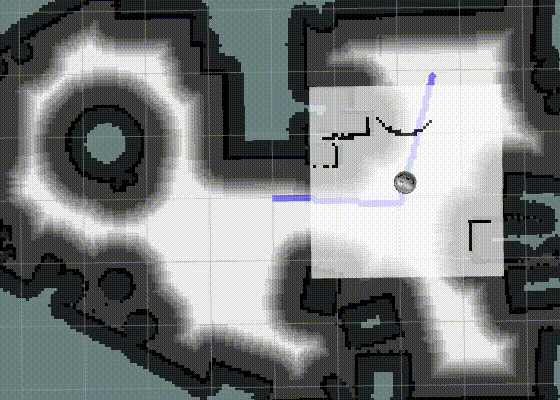
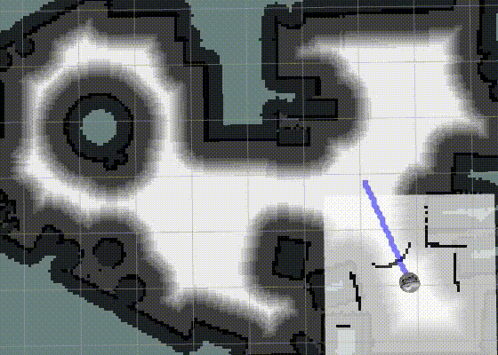

# TODO: Structure

- Introduction + gif of running version
- Overview /Structure (see https://github.com/dietriro/rto_core) + rqtgraph
- Packages with subscribed topics, published topics, services, config (params)
- How to run / Usage (roslaunch rto_nav..)
- Install (clone, catkin build, etc.)

# NavPy

## Introduction
A 2D navigation stack that takes in information from odometry, sensor streams, and a goal pose and outputs safe velocity commands that are sent to a mobile base. The navigation stack is implemented with Python and is based on the structure of the [ros navigation stack](http://wiki.ros.org/navigation). The prerequisites which are mentioned in the ros-navigation stack are also relevant for the NavPy navigation stack. The allgorithm was tested with a [simulation of the Festo Robotino robot (RTO)](https://github.com/dietriro/rto_simulation) in a virtual world in Gazebo. 

<table style="margin-left: auto; margin-right: auto; table-layout: fixed; width: 100%">
  <tr>
    <td style="width: 48%;"> </td>
  </tr>
  <tr>
    <td style="width: 48%;" valign="top"> <b>Gif.x:</b> NavPy
    </td>
  </tr>
</table>

## Structure/Overview
In the following, all packages within this repository are briefly explained.
Core Repository

### Core Repository

#### [rto_costmap_generator](https://github.com/KathiWinter/rto_Robot_Navigation/tree/main/rto_costmap_generator)
Generates the local and the global costmap.
#### [rto_map_server](https://github.com/KathiWinter/rto_Robot_Navigation/tree/main/rto_map_server)
Transforms a pgm file to a OccupancyGrid message
#### [rto_local_planer](https://github.com/KathiWinter/rto_Robot_Navigation/tree/main/rto_local_planner)
Creates a local path and allows the robot to follow the global path
#### [rto_localization](https://github.com/KathiWinter/rto_Robot_Navigation/tree/main/rto_localization)
Localizes the robot in the map
#### [rto_global_planer](https://github.com/KathiWinter/rto_Robot_Navigation/tree/main/rto_global_planner)
Plans a path between the robot pose and an arbitrary valid goal
#### [rto_navigation](https://github.com/KathiWinter/rto_Robot_Navigation/tree/main/rto_navigation)
Contains launch and configuration files for starting the robots navigation.
#### [rto_worlds](https://github.com/KathiWinter/rto_Robot_Navigation/tree/main/rto_worlds)
Contains world models etc. for bringing up a simulation environment (e.g. gazebo).

### Related Repositories

All other packages have been adapted from the following two repositories by dietro

#### [rto_simulation](https://github.com/dietriro/rto_simulation)
This repository contains everything needed for using the RTO in a simulated environment, like Gazebo.
- [rto_bringup_sim](https://github.com/KathiWinter/rto_Robot_Navigation/tree/main/rto_bringup_sim)
- [rto_simulation](https://github.com/KathiWinter/rto_Robot_Navigation/tree/main/rto_simulation)

##### [rto_core](https://github.com/dietriro/rto_core#robotino-core)
This repository contains everything needed to start-up the RTO in a simulated environment or the real-world, including localization and navigation. 
- [rto_bringup](https://github.com/KathiWinter/rto_Robot_Navigation/tree/main/rto_bringup) 
- [rto_core](https://github.com/KathiWinter/rto_Robot_Navigation/tree/main/rto_core)
- [rto_description](https://github.com/KathiWinter/rto_Robot_Navigation/tree/main/rto_description)
- [rto_msgs](https://github.com/KathiWinter/rto_Robot_Navigation/tree/main/rto_msgs)
- [rto_node](https://github.com/KathiWinter/rto_Robot_Navigation/tree/main/rto_node)
- [rto_safety](https://github.com/KathiWinter/rto_Robot_Navigation/tree/main/rto_safety)
- [rto_teleop](https://github.com/KathiWinter/rto_Robot_Navigation/tree/main/rto_teleop)

## Packages
In the following, all packages within this repository are briefly explained

### rto_costmap_generator
#### Description
This package contains the 'costmap_generator_node', which is used for generating the local and the global costmap. 

In order to allow the use of a point representation of the mobile robot for path planning, the static map from the map server has to be padded by the radius of the mobile robot and by an additional, optional safety distance. This leads to an area in that the robot should under no circumstances operate in. Therefore, the system will efficiently prevent the robot from crashing into obstacles that are positioned in the global costmap. This area is called the area of 'hard padding'. To additionally asign a higher cost to grid cells that are close to obstacles, a so called 'soft padding' area gets generated by the costmap generator. The robot is allowed to operate in the area but path planning through parts of the 'soft padded area' will lead to an additional cost that is taken into account by the global planner. The global costmap is a map of the type OccupancyGrid. Grid cells that are occupied by obstacles have the value 100, grid cells in the area of 'hard padding' the value 99 and grid cells in the area of 'soft padding' the values from 98 to 1. Free space is represented with the vlaue 0 and unknown space with the value -1. The following figures will represent three costmaps with the same 'hard padding' area but different types and sizes of the 'soft padding' area.

<table style="margin-left: auto; margin-right: auto; table-layout: fixed; width: 100%">
  <tr>
    <td style="width: 48%;"> </td>
    <td style="width: 48%;"> </td>
    <td style="width: 48%;"> </td>
  </tr>
  <tr>
    <td style="width: 48%;" valign="top"> <b>Fig.x:</b> 'Exponential' soft padding (0.2 m).
    </td>
    <td style="width: 48%;" valign="top">  <b>Fig.x:</b> 'Exponential' soft padding (1.0 m).
    </td>
    <td style="width: 48%;" valign="top">  <b>Fig.x:</b> 'Linear' soft padding (1.0 m).
    </td>
  </tr>
</table>

In a real world scenario it is not enough to make decisions based on a static global costmap, since dynamic changes in the surrounding might lead to significant changes in the global costmap. If these changes are not recognised by the system, the accuracy of the loclization will be drastically reduced. Therefore, obstacles that are not taken into account by the current version of the global costmap have to be recognized and added in order to allow a smooth and stable navigation of the mobile robot. The local costmap serves this purpose by considering the current laserscan range measurements. The figure bellow depicts the local costmap and a obstacle that is currently not part of the global costmap. 

<table style="margin-left: auto; margin-right: auto; table-layout: fixed; width: 300px;">
  <tr>
    <td style="width: 300px;"> </td>
  </tr>
  <tr>
    <td style="width: 300px;" valign="top"> <b>Fig.x:</b> Local costmap (green).
  </tr>
</table>

#### Subscribed Topics
##### `/scan`
To receive the LaserScan messages from the hokuyo laser scanner.
##### `/odom`
To receive the Odometry messages from the odometry system.
#### Published Topics
##### `/global_costmap`
To publish the OccupancyGrid of the padded global costmap.
##### `/local_costmap`
To publish the Occupancy Grid of the local costmap for visualization purpose.
##### `/local_obstacles`
To publish the PointCloud of sensed obstacles that has been transformed to the map frame.
#### Services
##### `/switch_maps`
Service that switches the static map that gets used by the costmap generator to generate the global costmap. 
request: map_nr_switch [int8]  
response: success [bool]
##### `/clear_map`
Service that resets the global costmap to its original state that only represents the padded static map. All additionally added obstacles will be deleted. 
request: command [string] ('clear') 
response: success [bool]
##### `/add_local_map`
Service that adds elements from the local_obstacle point cloud to the global costmap. 
request: command [string] ('stuck') 
response: success [bool]
#### Configuration
`init_map_nr`: Map to start the costmap generator with. 
`log_times`: Log execution times of critical operations. 
`debug_mode`: Return debugging messages to the terminal. 
`global_costmap`: 
- `robot_diameter`: The diameter of the robot used for 'hard padding'.
- `safety_distance`: Additional distance used for 'hard padding'.
- `padded_val`: Value of the grid elements that are part of the 'hard padding' area.
- `apply_soft_padding`: Apply the area of 'soft padding' to the global costmap.
- `decay_distane`: Distance from the area of 'hard padding' that is affected by 'soft padding'.
- `decay_type`: Decay type of the area of 'soft padding' (linear, exponential, reciprocal). 

`local_costmap`:
- `length`: Width and height of the local costmap.
- `frequency`: Frequency of updating the local costmap.
- `frequency_scan`: Frequency at which the laser scanner operates.

### rto_map_server
#### Description
This package contains the rto_map_server node, which transforms a pgm file to a OccupancyGrid message and is able to store and switch between multiple maps. The map server also adds meta information that is stored in the corresponding yaml file to the the OccupancyGrid message. The pgm and yaml files should be stored in the maps folder. To create the corresponding files for a new map existing packages like the 'slam_toolbox' and the ROS navigation stack 'map_saver' can be utilized. The information of the yaml file should be added in the form of a dictionary to the rto_map_server config file.

#### Subscribed Topics
none
#### Published Topics
##### `/map`
To publish the OccupancyGrid that has been constructed based on a pgm and yaml file.
#### Services
##### `/get_map`
Service that adds elements from the local_obstacle point cloud to the global costmap. 
request: map_nr [int64] 
response: map [nav_msgs/OccupancyGrid]
#### Configuration
`debug_mode`: Return debugging messages to the terminal. 
`maps_nr`: The number of maps being stored on the map server. 
`mapx`:
- `image`: Name of the pgm image stored in the maps folder
- `resolution`: Resolution of the pixels in meter.
- `origin`: List consiting of the x, y and z coordinate of the maps origin.
- `occupied_thresh`: Threshold of the grid value for being seen as occupied.
- `free_thresh`: Threshold of the grid value for being seen as free.

### rto_local_planner
#### Description
This package contains the local_planner_node, which creates a local path and allows the robot to follow the global path to reach the navigation goal.

The local planner implemented in this package is based on the dynamic window approach, which is an online collision avoidance strategy that samples trajectories from a generated valid search space and selects the best trajectory for the current situation with the help of a cost function. The cost function consists of four different seperate costs and is minimized in order to obtain the optimal control values. The four parts of the cost function are:

- cost based on linear velocity
- cost based on the angle towards the goal
- cost based on the proximity to the global path 
- cost based on the proximity to obstacles

The overall cost for a control pair is 0 if the robot travels with its maximal linear velocity, looks directly towards the goal, is exactely on the global path and the range to the closest obstacle is as big as possible. Based on the gain factors of the different costs the local planner will exhibit a certain behaviour. If the robot, for example, should dynamically avoid obstacles that are not part of the costmap, it would make sense to reduce the gain of the cost that is based on the proximity to the global path and increase the gain of the cost that is related to the proximity to obstacles. It the robot should however follow exactelly the global path, different gain values might make more sense. The following gifs show two completely different strategies for local planning.

<table style="margin-left: auto; margin-right: auto; table-layout: fixed; width: 100%">
  <tr>
    <td style="width: 48%;"> </td>
    <td style="width: 48%;"> </td>
  </tr>
  <tr>
    <td style="width: 48%;" valign="top"> <b>Gif.x:</b> Local planner focuses on avoiding obstacles (gain values: 18 12 15 15).
    </td>
    <td style="width: 48%;" valign="top"> <b>Gif.x:</b> Local planner focuses on staying on the global path (gain values: 28 2 80 1).
    </td>
  </tr>
</table>

Of course both strategies have advantages and disadvantages and it depends on the situation which version to use.
Please be aware of the fact that the parameters are tuned for the robot to work in the gazebo simulation environment. Applying the local planner to real world conditions might require additional parameter tuning.

<table style="margin-left: auto; margin-right: auto; table-layout: fixed; width: 100%">
  <tr>
    <td style="width: 48%;"> </td>
    <td style="width: 48%;"> </td>
    <td style="width: 48%;"> </td>
  </tr>
  <tr>
    <td style="width: 48%;" valign="top"> <b>Gif.x:</b> Initializing a recovery behaviour based on a fully blocked path.
    </td>
    <td style="width: 48%;" valign="top"> <b>Gif.x:</b> Initializing a recovery behaviour based on a partly blocked path.
    </td>
    <td style="width: 48%;" valign="top"> <b>Gif.x:</b> Initializing a recovery behaviour based on a trapped robot.
    </td>
  </tr>
</table>

### rto_localization
#### Description
This package contains the rto_localization node, which is responsible for localizing the robot in a map. When the rto_localization is launched it requests the map from the rto_map_server. For localizing the robot a Monte Carlo localization algorithm is used. 
The navigation is stack is able to work in a dynamic environment. Obstacles which are not part of the map will reduce the accuracy of the Monte Carlo localization. Therefore the map is updated by the rto_costmap_generator. The performance of the Monte Carlo localization is measured by the averaged error of all particles. After each iteration this error is calculated and decides whether the pose of the robot is measured by the Monte Carlo localization or odometry. If the error is smaller than a given threshold the estimated pose of the Monte Carlo localization is used. Otherwise, the estimated pose from the last iteration is updated according to the relative motion between these two iterations. The relative motion is received from the odometry. This is especially important when the robot senses a dynamic obstacle which is not yet included in the map. Such situations can be seen in the following. The localization relies on the odometry when it passes a dynamic obstacle solely by using the local planer in gif ... or by recalculating a new path in gif ... .

<table style="margin-left: auto; margin-right: auto; table-layout: fixed; width: 100%">
  <tr>
    <td style="width: 48%;"> </td>
    <td style="width: 48%;"> </td>
  </tr>
  <tr>
    <td style="width: 48%;" valign="top"> <b>Gif.x:</b> Pass dynamic obstacle solely by using local planer.
    </td>
    <td style="width: 48%;" valign="top"> <b>Gif.x:</b> Update map of localization and recalculate the path.
    </td>
    </td>
  </tr>
</table>

If the localization is not accurate for several iterations it might happen, that the particles drift away. By predicting the particles with a higher variance, the particles spread out and are able to catch the position of the robot again. This can be seen in gif ... . To make sure, that the variance is not dominating the prediction of the particles, it is adapted to the angular and translational velocity of the robot.
<table style="margin-left: auto; margin-right: auto; table-layout: fixed; width: 100%">
  <tr>
    <td style="width: 48%;"> </td>
  </tr>
  <tr>
    <td style="width: 48%;" valign="top"> <b>Gif.x:</b> Increased prediction variance when Monte Carlo localization is not accurate and odometry is used for estimate robot pose.
    </td>
  </tr>
</table>

#### Subscribed Topics
##### `/scan`
Laser scan of the robot to update the particles
##### `/odom`
Motion of the robot estimated by odometry to predict particles
##### `/global_costmap`
Update dynamic obstacles in the map used by the localization
#### Published Topics
##### `/particles`
Visualization of all particles in RVIZ as red arrows
##### `/particle`
Visualization of the estimated pose of the localization in RVIZ as green arrow
##### `/pose`
Estimated pose of the localization
#### Services
##### `/get_map`
Service that loads map of the static world. 
request: map_nr [int64] 
response: map [nav_msgs/OccupancyGrid]
#### Configuration
`dynamics_translation_noise_std_dev`: Each particle is predicted translational according to the odometry and a gaussian noise with this translation uncertainty. 
 
`dynamics_orientation_noise_std_dev`: Each particle is predicted rotatory according to the odometry and a gaussian noise with this orientation uncertainty. 
 
`num_particles`: Number of particles used in the Monte Carlo Localization. An increased number of particles would increase the performance of the algorithm. Due to computational cost this is a limiting factor and depends on the machine which is used to run the navigation algorithm. 
 
`num_beams`: Number of laser beams used for updating the particles. The algorithm subsamples equally from all the laser beams of the laser scanner of the robot. 
 
`update_rate`: This defines the prediction and update rate of the Monte Carlo Localization. 
 
`launch_style`: The particles of the localization can be initialized randomly in the map or 
close to the position where the robot is spawned. When the particles are initialized randomly at least 400 particles are necessary. 
 
`normalized_commulated_localization_error`: Treshhold which defines whether the localization or the odometry is used to estimate the robot pose. 
 
`variance_increase_for_bad_localization`:Defines how much the translation and orientation uncertainty is increased when the localization is not accurate and the odometry is used to estimate the pose of the robot . 

### rto_navigation
#### Description

### rto_worlds
#### Description

### rto_global_planner
#### Description
This package contains the global_planner_node, which creates a global path that can be used by local_planner.

The global planner is based on bi_directional astar algorithm. At the beginning, we start search both from current position and goal position. After each iteration, check whether there is an intersection between open list from start point and  goal point. If there is an intersection, then connect the path from start point and end point. In this case, the path might look like very strange, then we do path smoothing to avoid unnecessary turns. At last, to make sure local_planner will get a dense path which is represented by nodes next to each other, path argumentation is applied.

If there is no path from start point to goal point found at the first time, the global_planner will call service `/clear_map`. Then plan a path on the original costmap. This is to avoid the situation that the global costmap is updated due to some temporary obstacles, and this makes it impossible to find a path from start to goal. After a while, the obstacle disappeared, which makes us capable to find a path. So we call service `/clear_map` to make sure if it is solvable without temperoary obstacles.

#### Subscribed Topics
##### `/global_costmap`
To receive the padded costmap used to plan a feasible path
##### `/odom`
To receive the current position of robot as the start point
##### `/goal`
To receive the arranged point in map as the end point
#### Published Topics
##### `/global_path`
To publish the generated path message as a feasible path from current location to goal
##### `/visualization/plan`
To publish a visualized plan in rviz
#### Services
##### `/clear_map`
Service that resets the global costmap to its original state in case there is no path find from start point to end point at the first time, to avoid the situation that there is a path but a temporary obstacle makes it impossible to be found.
All additionally added obstacles will be deleted. 
request: command [string] ('clear') 
response: success [bool]

## Install and how to run

