# NavPy

## Introduction
A 2D navigation stack that takes in information from odometry, sensor streams, and a goal pose and outputs velocity commands that are sent to a mobile base. As a prerequisite for navigation stack use, the robot must be running ROS, have a tf transform tree in place, and publish sensor data using the correct ROS Message types. Also, the navigation stack needs to be configured for the shape and dynamics of a robot. The algorithm was tested with a [simulation of the Festo Robotino robot (RTO)](https://github.com/dietriro/rto_simulation) in a virtual world in Gazebo. 

<table style="margin-left: auto; margin-right: auto; table-layout: fixed; width: 100%">
  <tr>
    <td style="width: 48%;"> </td>
  </tr>
  <tr>
    <td style="width: 48%;" valign="top"> <b>GIF 1:</b> NavPy in action.
    </td>
  </tr>
</table>

## Structure/Overview
Fig.1 depicts the ROS computation graph of the NavPy navigation stack. It contains all necessary nodes and the topics that are used for communication between nodes.

<table style="margin-left: auto; margin-right: auto; table-layout: fixed; width: 100%">
  <tr>
    <td style="width: 1000px;"> 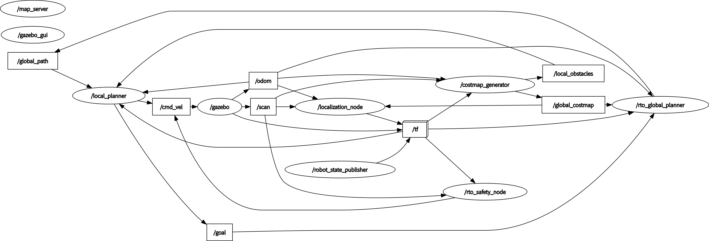</td>
  </tr>
  <tr>
    <td style="width: 1000px;" valign="top"> <b>Fig.1:</b> ROS computation graph of the NavPy navigation stack.
  </tr>
</table>

In the following, all packages within this repository are briefly explained.

### Core Repository

#### [rto_costmap_generator](https://github.com/KathiWinter/NavPy/tree/main/rto_costmap_generator)
Responsible for creating the local and the global costmap and adapting the costmaps to dynamic changes of the world.
#### [rto_map_server](https://github.com/KathiWinter/NavPy/tree/main/rto_map_server)
Transforms pgm files to occupancy grid maps and lets other nodes access these static maps via a service.
#### [rto_local_planer](https://github.com/KathiWinter/NavPy/tree/main/rto_local_planner)
Creates a local path based on minimizing a cost function that leads the robot towards the goal.
#### [rto_localization](https://github.com/KathiWinter/NavPy/tree/main/rto_localization)
Localizes the robot in the map.
#### [rto_global_planer](https://github.com/KathiWinter/NavPy/tree/main/rto_global_planner)
Plans a path between the robot pose and an arbitrary valid goal.
#### [rto_navigation](https://github.com/KathiWinter/NavPy/tree/main/rto_navigation)
Contains the launch file to start up the NavPy navigation stack.
#### [rto_worlds](https://github.com/KathiWinter/NavPy/tree/main/rto_worlds)
Contains world models that are used by the Gazebo simulation.

### Related Repositories

All other packages have been adapted from the following two repositories by dietro.

#### [rto_simulation](https://github.com/dietriro/rto_simulation)
This repository contains everything needed for using the RTO in a simulated environment, like Gazebo.
- [rto_bringup_sim](https://github.com/KathiWinter/rto_Robot_Navigation/tree/main/rto_bringup_sim)
- [rto_simulation](https://github.com/KathiWinter/rto_Robot_Navigation/tree/main/rto_simulation)

#### [rto_core](https://github.com/dietriro/rto_core#robotino-core)
This repository contains everything needed to start-up the RTO in a simulated environment or the real-world, including localization and navigation. 
- [rto_bringup](https://github.com/KathiWinter/rto_Robot_Navigation/tree/main/rto_bringup) 
- [rto_core](https://github.com/KathiWinter/rto_Robot_Navigation/tree/main/rto_core)
- [rto_description](https://github.com/KathiWinter/rto_Robot_Navigation/tree/main/rto_description)
- [rto_msgs](https://github.com/KathiWinter/rto_Robot_Navigation/tree/main/rto_msgs)
- [rto_node](https://github.com/KathiWinter/rto_Robot_Navigation/tree/main/rto_node)
- [rto_safety](https://github.com/KathiWinter/rto_Robot_Navigation/tree/main/rto_safety)
- [rto_teleop](https://github.com/KathiWinter/rto_Robot_Navigation/tree/main/rto_teleop)


## Packages
In the following, all packages within this repository are briefly explained.

### rto_costmap_generator
#### Description
This package contains the 'costmap_generator_node', which is used for generating the local and the global costmap. 

In order to allow the use of a point representation of the mobile robot for path planning, the static map from the map server has to be padded by the radius of the mobile robot and by an additional, optional safety distance. This leads to an area in that the robot should under no circumstances operate in. Therefore, the system will efficiently prevent the robot from crashing into obstacles that are positioned in the global costmap. This area is called the area of 'hard padding'. To additionally assign a higher cost to grid cells that are close to obstacles, a so called 'soft padding' area gets generated by the costmap generator. The robot is allowed to operate in the area but path planning through parts of the 'soft padded area' will lead to an additional cost that is taken into account by the global planner. The global costmap is a map of the type OccupancyGrid. Grid cells that are occupied by obstacles have the value 100, grid cells in the area of 'hard padding' the value 99 and grid cells in the area of 'soft padding' the values from 98 to 1. Free space is represented with the value 0 and unknown space with the value -1. The following figures will represent three costmaps with the same 'hard padding' area but different types and sizes of the 'soft padding' area.

<table style="margin-left: auto; margin-right: auto; table-layout: fixed; width: 100%">
  <tr>
    <td style="width: 48%;"> 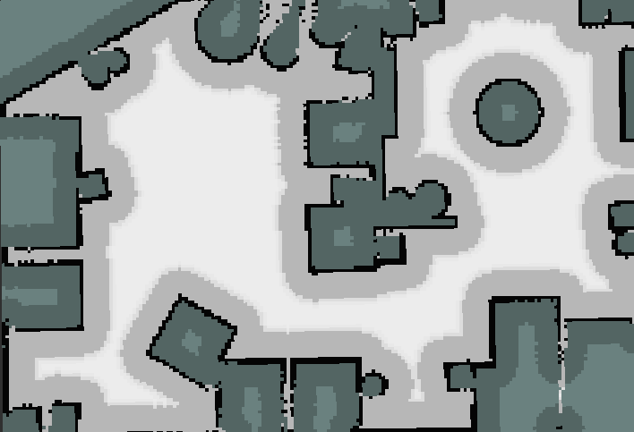</td>
    <td style="width: 48%;"> 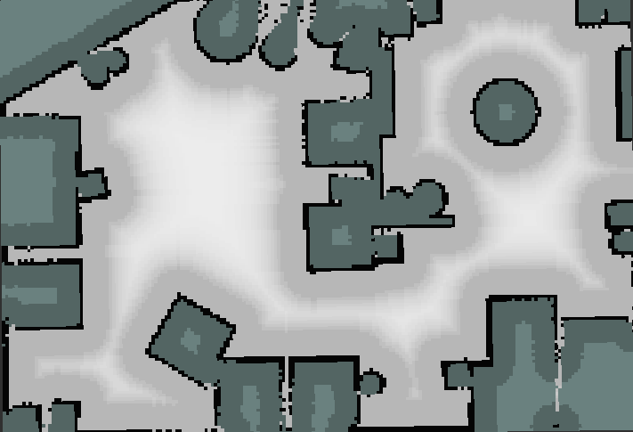</td>
    <td style="width: 48%;"> 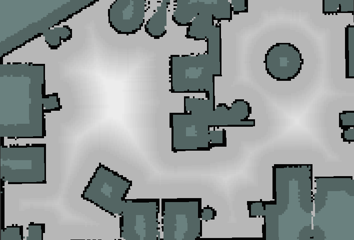</td>
  </tr>
  <tr>
    <td style="width: 48%;" valign="top"> <b>Fig.2:</b> 'Exponential' soft padding (0.2 m).
    </td>
    <td style="width: 48%;" valign="top">  <b>Fig.3:</b> 'Exponential' soft padding (1.0 m).
    </td>
    <td style="width: 48%;" valign="top">  <b>Fig.4:</b> 'Linear' soft padding (1.0 m).
    </td>
  </tr>
</table>


In a real world scenario it is not enough to make decisions based on a static global costmap, since dynamic changes in the surrounding might lead to significant changes in the global costmap. If these changes are not recognized by the system, the accuracy of the localization will be drastically reduced. Therefore, obstacles that are not taken into account by the current version of the global costmap have to be recognized and added in order to allow a smooth and stable navigation of the mobile robot. The local costmap serves this purpose by considering the current laser scan range measurements. Fig.5 depicts the local costmap and an obstacle that is currently not part of the global costmap. 

<table class="center" style="margin-left: auto; margin-right: auto; table-layout: fixed; width: 200%">
  <tr>
    <td style="width: 800px;"> 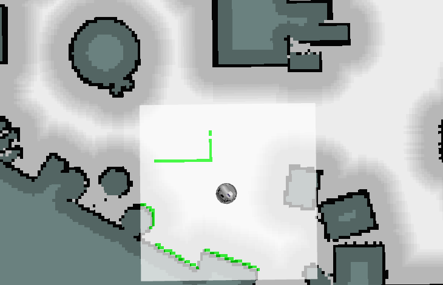</td>
  </tr>
  <tr>
    <td style="width: 800px;" valign="top"> <b>Fig.5:</b> Local costmap (green) detects a new obstacle.
  </tr>
</table>

#### Subscribed Topics
##### `/scan`
To receive the laser scan messages from the Hokuyo laser scanner which is necessary for detecting local obstacles.
##### `/odom`
To receive the odometry messages from the odometry system.
#### Published Topics
##### `/global_costmap`
To publish the occupancy grid of the padded global costmap.
##### `/local_costmap`
To publish the occupancy grid of the local costmap for visualization purposes.
##### `/local_obstacles`
To publish the point cloud of sensed obstacles that has been transformed to the map frame.
#### Services
##### `/switch_maps`
Service that switches the static map that gets used by the costmap generator to generate the global costmap.<br>
request: map_nr_switch [int8] <br>
response: success [bool]
##### `/clear_map`
Service that resets the global costmap to its original state that only represents the padded static map. All additionally added obstacles will be deleted.<br>
request: command [string] ('clear')<br>
response: success [bool]
##### `/add_local_map`
Service that adds elements from the local_obstacle point cloud to the global costmap.<br>
request: command [string] ('stuck')<br>
response: success [bool]
#### Configuration
`init_map_nr`: Map to start the costmap generator with.<br>
`log_times`: Log execution times of critical operations.<br>
`debug_mode`: Return debugging messages to the terminal.<br>
`global_costmap`: 
- `robot_diameter`: The diameter of the robot used for 'hard padding'.
- `safety_distance`: Additional distance used for 'hard padding'.
- `padded_val`: Value of the grid elements that are part of the 'hard padding' area.
- `apply_soft_padding`: Apply the area of 'soft padding' to the global costmap.
- `decay_distance`: Distance from the area of 'hard padding' that is affected by 'soft padding'.
- `decay_type`: Decay type of the area of 'soft padding' (linear, exponential, reciprocal).<br>

`local_costmap`:
- `length`: Width and height of the local costmap.
- `frequency`: Frequency of updating the local costmap.
- `frequency_scan`: Frequency at which the laser scanner operates.


### rto_map_server
#### Description
This package contains the rto_map_server node, which transforms a pgm file to an occupancy grid map and is able to store and switch between multiple maps. The map server also adds meta information that is stored in the corresponding yaml file to the the OccupancyGrid message. The pgm and yaml files should be stored in the maps folder. To create the corresponding files for a new map existing packages like the 'slam_toolbox' and the ROS navigation stack 'map_saver' can be utilized. The information of the yaml file should be added in the form of a dictionary to the rto_map_server config file.

#### Subscribed Topics
none
#### Published Topics
##### `/map`
To publish the OccupancyGrid that has been constructed based on a pgm and yaml file.
#### Services
##### `/get_map`
Service that adds elements from the local_obstacle point cloud to the global costmap.<br>
request: map_nr [int64]<br>
response: map [nav_msgs/OccupancyGrid]
#### Configuration
`debug_mode`: Return debugging messages to the terminal.<br>
`maps_nr`: The number of maps being stored on the map server.<br>
`mapx`:
- `image`: Name of the pgm image stored in the maps folder
- `resolution`: Resolution of the pixels in meter.
- `origin`: List consisting of the x, y and z coordinate of the map's origin.
- `occupied_thresh`: Threshold of the grid value for being seen as occupied.
- `free_thresh`: Threshold of the grid value for being seen as free.


### rto_local_planner
#### Description
This package contains the local_planner_node, which creates a local path and allows the robot to follow the global path to reach the navigation goal.

The local planner implemented in this package is based on the dynamic window approach, which is an online collision avoidance strategy that samples trajectories from a generated valid search space and selects the best trajectory for the current situation with the help of a cost function. The cost function consists of four different separate costs and is minimized in order to obtain the optimal control values. The four parts of the cost function are:

- cost based on linear velocity
- cost based on the angle towards the goal
- cost based on the proximity to the global path 
- cost based on the proximity to obstacles

The overall cost for a control pair is 0 if the robot travels with its maximal linear velocity, looks directly towards the goal, is exactly on the global path and the range to the closest obstacle is as big as possible. Based on the gain factors of the different costs the local planner will exhibit a certain behaviour. If the robot, for example, should dynamically avoid obstacles that are not part of the costmap, it would make sense to reduce the gain of the cost that is based on the proximity to the global path and increase the gain of the cost that is related to the proximity to obstacles. It the robot should however follow exactly the global path, different gain values might make more sense. The following GIFs show two completely different strategies for local planning.

<table class="center" style="margin-left: auto; margin-right: auto; table-layout: fixed; width: 100%">
  <tr>
    <td style="width: 48%;"> 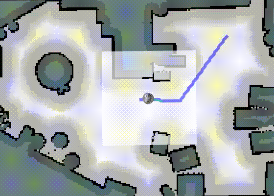</td>
    <td style="width: 48%;"> 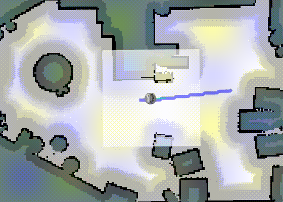</td>
  </tr>
  <tr>
    <td style="width: 48%;" valign="top"> <b>GIF 2:</b> Local planner focuses on avoiding obstacles (gain values: 18 12 15 15).
    </td>
    <td style="width: 48%;" valign="top"> <b>GIF 3:</b> Local planner focuses on staying on the global path (gain values: 28 2 80 1).
    </td>
  </tr>
</table>

Of course both strategies have advantages and disadvantages and it depends on the situation which version to use.
Please be aware of the fact that the parameters are tuned for the robot to work in the Gazebo simulation environment. Applying the local planner to real world conditions might require additional parameter tuning.

The local planner node not only estimates the best control values, but also initialize a so called recovery behaviour that adds the local costmap to the global costmap via the service 'add_local_costmap' and publishes the current goal position again to initiate a re-planning of the global path. This is necessary in order to allow the system to react to changes of the world it operates in. Therefore, the local planner needs a couple of measures to decide if a recovery behaviour is necessary. The implemented measures are listed below:

- small linear velocity
- circling
- execution time of the current path

Based on the values of the related parameters a recovery behaviour will be carried out when the linear velocity is below a certain threshold for a certain amount of time. This can often be traced back to a global path blocked by an obstacle that is currently not included in the global costmap. This particular case can also lead to the robot circling in front of the obstacle. For this reason, a recovery behaviour is also initialized when the sign of the robots angular velocity does not change for a specific time period. The last measure for initializing a recovery behaviour is the execution time of the current path. If the robot takes longer than expected to reach the goal position, this might also indicate that a recovery behaviour makes sense in this situation. The GIFs below demonstrate the typical scenarios that lead to a initialization and execution of a recovery behaviour.

<table style="margin-left: auto; margin-right: auto; table-layout: fixed; width: 100%">
  <tr>
    <td style="width: 33%;"> 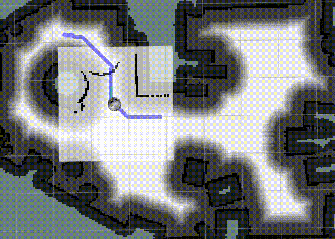</td>
    <td style="width: 33%;"> 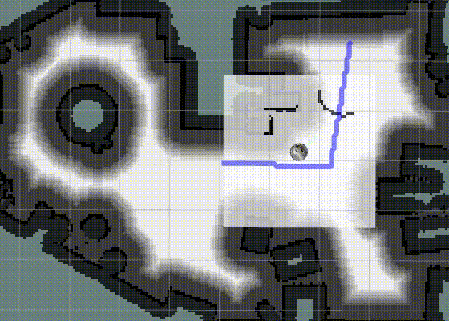</td>
    <td style="width: 33%;"> 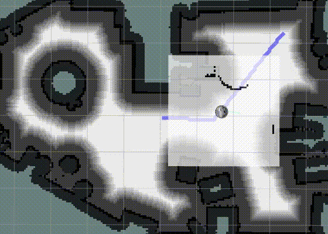</td>
  </tr>
  <tr>
    <td style="width: 33%;" valign="top"> <b>GIF 4:</b> Initializing a recovery behaviour based on a small linear velocity.
    </td>
    <td style="width: 33%;" valign="top"> <b>GIF 5:</b> Initializing a recovery behaviour based on circling.
    </td>
    <td style="width: 33%;" valign="top"> <b>GIF 6:</b> Initializing a recovery behaviour based on path execution time.
    </td>
  </tr>
</table>

#### Subscribed Topics
##### `/odom`
To receive the current position in the odometry frame.
##### `/global_path`
To calculate the distance of the robot to the global path and to estimate the angle to the goal.
##### `/local_obstacles`
To estimate the minimal distances of possible trajectories to the currently sensed obstacles. 
#### Published Topics
##### `/cmd_vel`
To publish the best control pair in order to let the robot move as desired.
##### `/visualization/local_path`
To publish a line strip marker that can be visualized in rviz.
##### `goal`
To initialize a re-planning of the global path after new obstacles have been added to the costmap.
#### Configuration
`log_times`: Log execution times of critical operations.<br>
`debug_mode`: Return debugging messages to the terminal.<br>
`show_path`: Show a representation of the local path in rviz.<br>
`lookahead`: Time span (dt) used for the motion update and the estimation of the dynamic window.<br>
`robot_diameter`: Diameter of the robot used to determine if a trajectory could result in a crash.<br>
`safety_distance`: Distance that is additionally used with the robot diameter to estimate valid trajectories.<br>
`min_linear_vel`: Minimum linear velocity of the robot.<br>
`max_linear_vel`: Maximum linear velocity of the robot.<br>
`min_angular_vel`: Minimum angular velocity of the robot.<br>
`max_angular_vel`: Maximum angular velocity of the robot.<br>
`max_acc`: Maximum acceleration of the robot.<br>
`max_dec`: Maximum deceleration.<br>
`res_ang_vel_space`: Resolution of the angular velocity in the dynamic window.<br>
`res_lin_vel_space`: Resolution of the linear velocity in the dynamic window.<br>
`gain_vel`: Gain factor of the cost based on linear velocity.<br>
`gain_goal_angle`: Gain factor of the cost based on the angle towards the goal.<br>
`gain_glob_path`: Gain factor of the cost based on the proximity to the global path.<br>
`gain_clearance`: Gain factor of the cost based on the proximity to obstacles.<br>
`rec_min_lin_vel`: Velocity threshold for a recovery based on small linear velocities.<br>
`rec_min_lin_vel_time`: Time period in which the velocity has to be under the threshold.<br>
`rec_circling_time`: Time period for circling after which the recovery behaviour gets initialized.<br>
`rec_path_time_factor`: Factor that decides when to initialize a recovery behaviour based on overall path execution time.<br>
`rec_path_len`: Minimal length of a global path to be considered for a recovery behaviour based on overall path execution time.<br>
`min_dist_goal`: Distance to goal that is considered enough to declare that the goal has been reached.<br>


### rto_localization
#### Description
This package contains the rto_localization node, which is responsible for localizing the robot in a map. When the rto_localization is launched it requests the map from the rto_map_server. For localizing the robot a Monte Carlo localization algorithm is used. The navigation stack is able to work in a dynamic environment. Obstacles which are not included in the map will reduce the accuracy of the Monte Carlo localization drastically. Therefore, the map is updated by the rto_costmap_generator. The performance of the Monte Carlo localization is measured by the averaged error of all particles. This performance measurement is used to decide whether the pose of the robot is estimated by the Monte Carlo localization or the odometry. The Monte Carlo Localization is used if the error is smaller than a given threshold. Otherwise, the estimated pose from the last iteration is updated according to the relative motion since then. The relative motion is received from the odometry. This is especially important when the robot senses a dynamic obstacle which is not yet included in the map. Such situations can be seen in the following. In GIF 7 the localization relies on the odometry when it passes a dynamic obstacle solely by using the local planer. In this example the obstacle is not included in the map. In GIF 8 the global path is recalculated by the global planer and the map is updated by the rto_costmap_generator. As soon as the obstacle is included in the map the particles of the Monte Carlo Localization estimate the pose of the robot much better. Before the update the localization relies on the odometry.


<table style="margin-left: auto; margin-right: auto; table-layout: fixed; width: 100%">
  <tr>
    <td style="width: 48%;"> 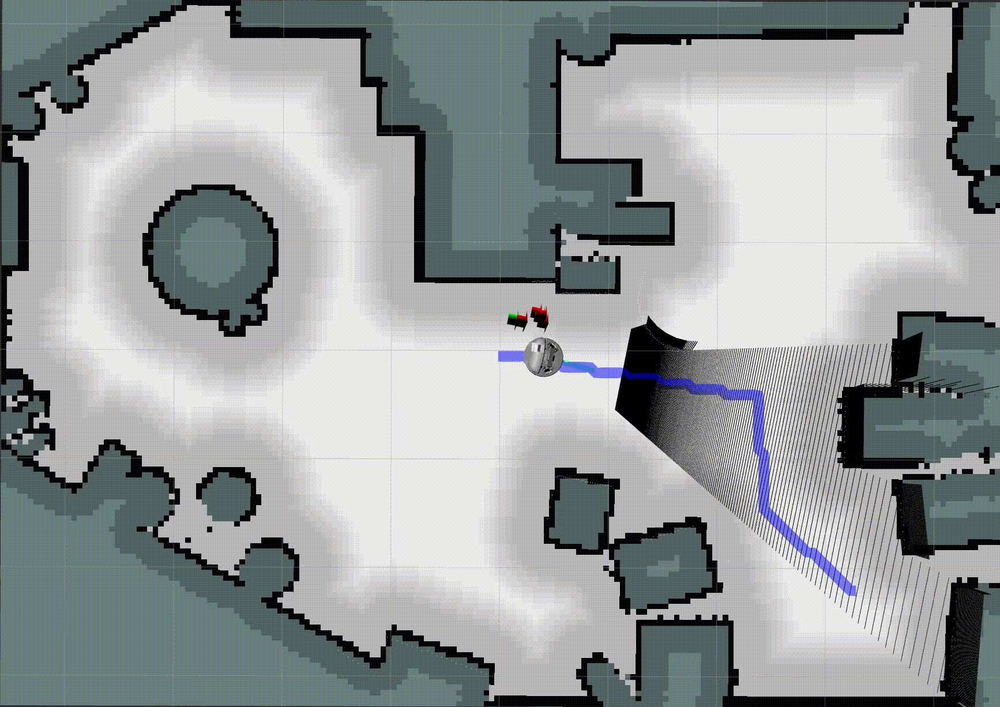</td>
    <td style="width: 48%;"> </td>
  </tr>
  <tr>
    <td style="width: 48%;" valign="top"> <b>GIF 7:</b> Pass dynamic obstacle solely by using local planer.
    </td>
    <td style="width: 48%;" valign="top"> <b>GIF 8:</b> Update map of localization and recalculate the path.
    </td>
    </td>
  </tr>
</table>

If the localization is not accurate for several iterations it might happen, that the particles drift away. By predicting the particles with a higher variance, the particles spread out. This allows the Monte Carlo localization to catch the pose of the robot again. It can be seen in GIF 9 . To make sure, that the variance is not dominating the prediction of the particles, it is adapted to the angular and translational velocity of the robot.
<table class="center" style="margin-left: auto; margin-right: auto; table-layout: fixed; width: 100%">
  <tr>
    <td  class="center" style="width: 48%;"> 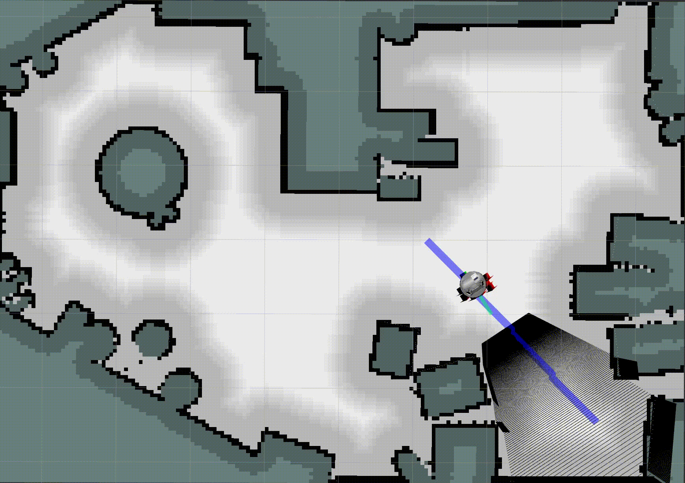</td>
  </tr>
  <tr>
    <td style="width: 48%;" valign="top"> <b>GIF 9:</b> Increased prediction variance when Monte Carlo localization is not accurate and odometry is used for estimate robot pose.
    </td>
  </tr>
</table>


#### Subscribed Topics
##### `/scan`
Laser scan of the robot to update the particles.
##### `/odom`
Motion of the robot estimated by odometry to predict particles.
##### `/global_costmap`
Update dynamic obstacles in the map.
#### Published Topics
##### `/particles`
Visualization of all particles in rvis as red arrows.
##### `/particle`
Visualization of the estimated pose of the localization in rviz as green arrow.
##### `/pose`
Estimated pose of the localization.
#### Services
None
#### Configuration
`dynamics_translation_noise_std_dev`: Each particle is predicted translational according to the odometry and a gaussian noise with this standard deviation.<br>
`dynamics_orientation_noise_std_dev`: Each particle is predicted rotatory according to the odometry and a gaussian noise with this standard deviation.<br>
`num_particles`: Number of particles used in the Monte Carlo Localization.<br>
`num_beams`: Number of laser beams used for updating the particles. The algorithm subsamples equally from all the laser beams of the robot's laser scanner <br>
`update_rate`: This defines the prediction and update rate of the Monte Carlo Localization.<br>
`launch_style`: The particles of the localization can be initialized randomly in the map or close to the position where the robot is spawned.<br>
`normalized_comulated_localization_error`: Threshold which defines whether the localization or the odometry is used to estimate the robot's pose.<br>
`variance_increase_for_bad_localization`: Defines how much the translation and orientation standard deviation is increased when the localization is not accurate and the odometry is used to estimate the pose of the robot .<br>

### rto_global_planner
#### Description
This package contains the global_planner_node, which creates a global path that can be used by local_planner.

The global planner is based on bidirectional A-Star algorithm. At the beginning, we start search both from current position and goal position. After each iteration, check whether there is an intersection between open list from start point and  goal point. If there is an intersection, then connect the path from start point and end point. In this case, the path might look like very strange(see Fig.10), then we do path smoothing to avoid unnecessary turns(see Fig.11). At last, to make sure local_planner will get a dense path which is represented by nodes next to each other, path argumentation is applied(see GIF 10).

<table style="margin-left: auto; margin-right: auto; table-layout: fixed; width: 100%">
  <tr>
    <td style="width: 48%;"> 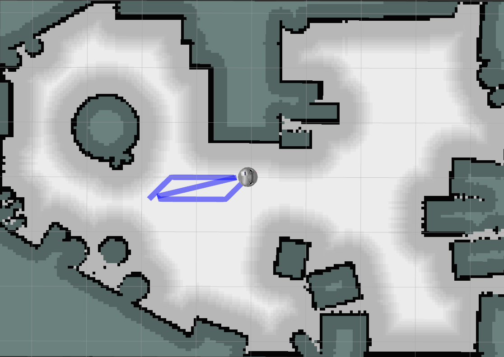</td>
    <td style="width: 48%;"> 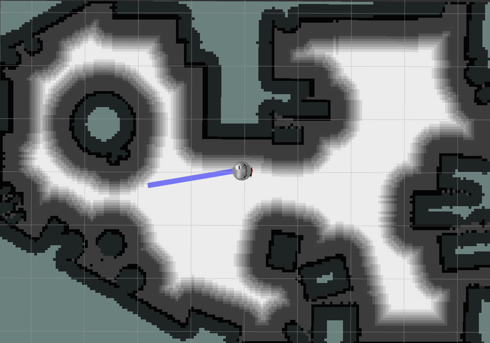</td>
    <td style="width: 48%;"> 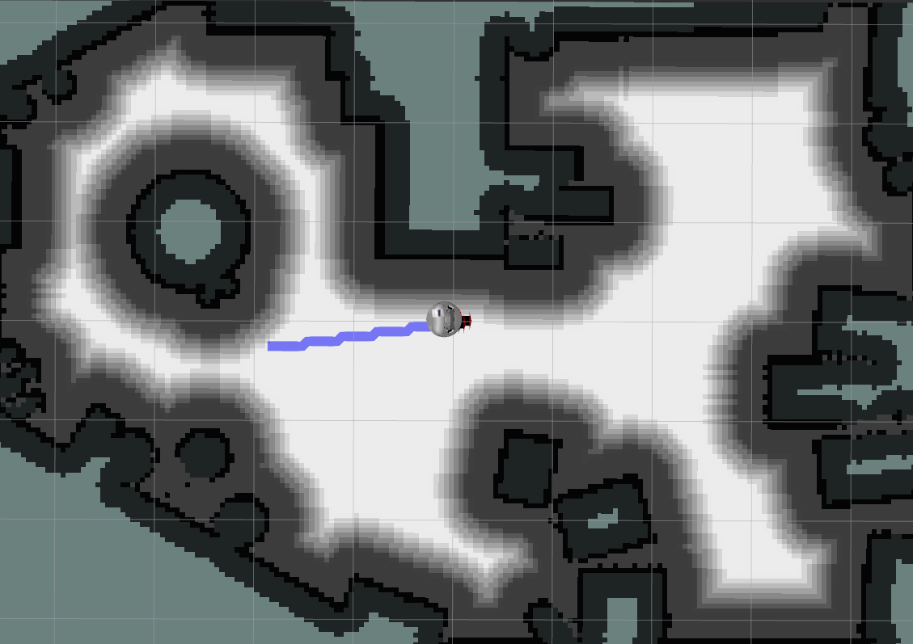</td>
  </tr>
  <tr>
    <td style="width: 48%;" valign="top"> <b>Fig.6:</b> Original path generated by bi-directional a_star.
    </td>
    <td style="width: 48%;" valign="top"> <b>Fig.7:</b> Path after doing path smoothing.
    </td>
    <td style="width: 48%;" valign="top"> <b>Fig.8:</b> Dense path for local planner.
    </td>
  </tr>
</table>

In some cases, there might be no path from start to end. To make sure reliability of the no path situation, the global_planner will call service `/clear_map`, if there is no path from start point to goal point found at the first time. Then global planner will try to plan a path on the original costmap. This is to avoid the situation that the global costmap is updated due to some temporary obstacles(which is not there anymore), and this makes it impossible to find a path from start to goal. So we call service `/clear_map` to make sure if it is solvable without temporary obstacles(see GIF 10).

<table class="center" style="margin-left: auto; margin-right: auto; table-layout: fixed; width: 800px">
  <tr>
    <td class="center" style="width: 48%;"> 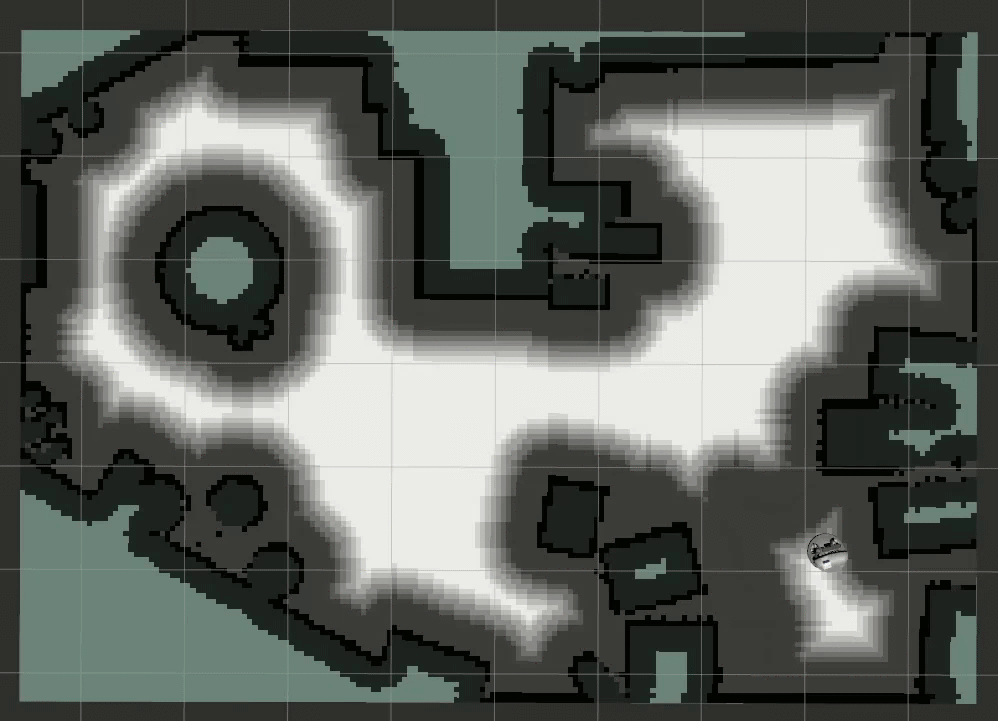</td>
  </tr>
  <tr>
    <td style="width: 48%;" valign="top"> <b>GIF 10:</b> 
      Path cannot be found due to disappeared temporary obstacle, call clear map and re-plan.
    </td>
  </tr>
</table>

#### Subscribed Topics
##### `/global_costmap`
To receive the padded costmap used to plan a feasible path.
##### `/odom`
To receive the current position of robot as the start point.
##### `/goal`
To receive the arranged point in map as the end point.
#### Published Topics
##### `/global_path`
To publish the generated path message as a feasible path from current location to goal.
##### `/visualization/plan`
To publish a visualized plan in rviz.


## Installation
In order to use the robot you first have to install Ubuntu Focal (20.04) as well as ROS Noetic, which currently is the only supported ROS version of this repository. Besides, you will need to install necessary dependencies of Robotino robot. For details in installing of ROS Noetic as well as all necessary dependencies, please refer to [rto_core](https://github.com/dietriro/rto_core).

Afterwards you have to clone this repository to your catkin space and build it.
```bash
cd ~/catkin_ws/src
git clone https://github.com/KathiWinter/rto_Robot_Navigation.git
cd ~/catkin_ws
catkin build
```

## Usage
To use this robot in simulation world, you will have export the following environment variables first:

    export ROBOT=rto-1
    export ROBOT_ENV=world1
    
To start up the robot in the Gazebo simulation environment, the line below should be entered into the terminal:

    roslaunch rto_bringup_sim robot.launch
    
Afterwards, the NavPy navigation stack can be launched via the launch file navigation_navpy.launch: 

    roslaunch rto_navigation navigation_navpy.launch

To bring up rviz for visualization purposes, please enter the following line into the terminal.

    roslaunch rto_bringup rviz.launch

